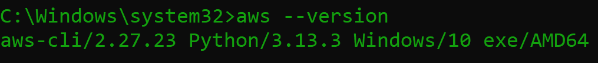

# AWS Account Reset Using AWS Nuke 🚀

<p align="center">
  
  
  
  
</p>


*AWS account before running AWS Nuke.*

---

## Overview

AWS Nuke is an open-source tool to delete all resources in an AWS account, restoring it to a clean state.  
[Full documentation →](https://github.com/rebuy-de/aws-nuke)

---

## Quick Links

- [AWS CLI Install/Update](https://docs.aws.amazon.com/cli/latest/userguide/getting-started-install.html)
- [AWS Nuke GitHub](https://github.com/rebuy-de/aws-nuke)
- [Cloud Nuke (Gruntwork)](https://github.com/gruntwork-io/cloud-nuke)
- [YouTube Guide Tutorial](https://youtu.be/odk_NuQNJTc?si=wypMlFZcLFyxkEd9)

---

## Prerequisites

- AWS CLI installed and configured
- Admin access to your AWS account
- AWS Nuke installed (`cloud-nuke` or `cloud-nuke.exe` for Windows)

---

## Installation

**1. Install or update AWS CLI**

```bash
aws --version
```


**2. Configure AWS CLI**

```bash
aws configure
```


**3. Install AWS Nuke**

- **macOS/Linux**:  
  ```bash
  brew install cloud-nuke
  ```
- **Windows**:  
  - Recommended:  
    ```bash
    winget install cloud-nuke
    ```
  - Or use the included `cloud-nuke.exe` in this repo:  
    - Download or copy `cloud-nuke.exe` to your working directory.  
    - Run commands as `cloud-nuke.exe ...`

---

## Usage

**1. (Optional) List S3 Buckets**

```bash
aws s3 ls
```


**2. AWS Nuke Help**

```bash
cloud-nuke -h
```


**3. Inspect Resources (Preview what will be deleted)**

```bash
cloud-nuke inspect-aws --region ap-south-1
```
  


**Video: Inspect Command Demo**  
[](screenshots/administrator-command-prompt-cloud-nuke-inspect-aws-2025-05-28-23-55-25.mp4)

**4. (Optional) List Resource Types**

```bash
cloud-nuke aws --list-resource-types
```


**5. (Recommended) Dry Run**

```bash
cloud-nuke aws --resource-type ec2 --dry-run
```


**6. Nuke All Resources**

```bash
cloud-nuke aws --region ap-south-1
```
  
  
  
  


---

## Security

- Never commit AWS credentials to GitHub.
- Use IAM roles and temporary credentials.
- Remove sensitive info from screenshots.
- Add credential files to `.gitignore`.

[Security Best Practices →](https://docs.aws.amazon.com/IAM/latest/UserGuide/best-practices.html)

---

## Additional Resources

- [AWS Nuke GitHub](https://github.com/rebuy-de/aws-nuke)
- [Cloud Nuke (Gruntwork)](https://github.com/gruntwork-io/cloud-nuke)
- [YouTube: AWS Nuke Guide](https://youtu.be/odk_NuQNJTc?si=wypMlFZcLFyxkEd9)

---

## Acknowledgments

Special thanks to [Senior Name](https://github.com/senior-github) ([Medium](https://medium.com/@senior-medium) | [LinkedIn](https://linkedin.com/in/senior-linkedin))  
for guidance and support in helping me discover and successfully use AWS Nuke to reset my AWS account.

---

## Reference Video

The following YouTube video was instrumental in completing this project:  
[YouTube: AWS Nuke Guide](https://youtu.be/odk_NuQNJTc?si=wypMlFZcLFyxkEd9)

---

## Built With Love

This project was created with ❤️ by **Subhajit Chowdhury**.

**Connect with me:**  
- [LinkedIn](https://www.linkedin.com/in/subhajitch0wdhury/)
- [GitHub](https://github.com/Subhajit-Chowdhury)
- Email: er.subhajitchowdhury@gmail.com

---

MIT License. See LICENSE file.

---

Thank you for visiting the **Nuke_AWS** project.  
Happy nuking! 💥