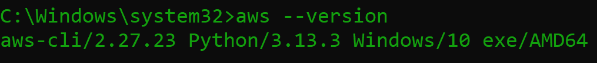

# AWS Account Reset Using AWS Nuke 🚀

<p align="center">
  
</p>

<p align="center">
  
  
  
  
</p>

<br/>

  
*Shows the AWS account with resources before cleanup.*

---

<p align="center">
  
</p>

## Overview

AWS Nuke is an open-source tool to delete all resources in an AWS account, restoring it to a clean state.  
[Full documentation →](https://github.com/rebuy-de/aws-nuke)

---

<p align="center">
  
</p>

## Quick Links

- [AWS CLI Install/Update](https://docs.aws.amazon.com/cli/latest/userguide/getting-started-install.html)
- [AWS Nuke GitHub](https://github.com/rebuy-de/aws-nuke)
- [Cloud Nuke (Gruntwork)](https://github.com/gruntwork-io/cloud-nuke)
- [YouTube Guide Tutorial](https://youtu.be/odk_NuQNJTc?si=wypMlFZcLFyxkEd9)

---

<p align="center">
  
</p>

## Prerequisites

- AWS CLI installed and configured  
- Admin access to your AWS account  
- AWS Nuke installed (`cloud-nuke` or `cloud-nuke.exe` for Windows)  

---

<p align="center">
  
</p>

## Installation

**1. Install or update AWS CLI**

```bash
aws --version
```
  
*Verifies AWS CLI is installed and accessible.*

<br/>

**2. Configure AWS CLI**

```bash
aws configure
```
  
*Configure your AWS credentials and default region.*

<br/>

**3. Install AWS Nuke**

- **macOS/Linux**:  
  ```bash
  brew install cloud-nuke
  ```
- **Windows**:  
  - Recommended:  
    ```bash
    winget install cloud-nuke
    ```
  - Or use the included `cloud-nuke.exe` in this repo:  
    - Download or copy `cloud-nuke.exe` to your working directory.  
    - Run commands as `cloud-nuke.exe ...`

---

<p align="center">
  
</p>

## Usage

**1. (Optional) List S3 Buckets**

```bash
aws s3 ls
```
  
*Displays all S3 buckets in your AWS account before cleanup.*

<br/>

**2. AWS Nuke Help**

```bash
cloud-nuke -h
```
  
*Shows available commands and options for AWS Nuke.*

<br/>

**3. Inspect Resources (Preview what will be deleted)**

```bash
cloud-nuke inspect-aws --region ap-south-1
```
  
*Scans and lists all AWS resources in the specified region.*

  
*Detailed output of resources found during inspection.*

<br/>

**Video: Inspect Command Demo**  
[](screenshots/administrator-command-prompt-cloud-nuke-inspect-aws-2025-05-28-23-55-25.mp4)  
*Video walkthrough of the inspect command in action.*

<br/>

**4. (Optional) List Resource Types**

```bash
cloud-nuke aws --list-resource-types
```
  
*Lists all AWS resource types that can be deleted by AWS Nuke.*

<br/>

**5. (Recommended) Dry Run**

```bash
cloud-nuke aws --resource-type ec2 --dry-run
```
  
*Simulates the deletion process to preview what will be removed.*

<br/>

**6. Nuke All Resources**

```bash
cloud-nuke aws --region ap-south-1
```
  
*AWS Nuke asks for confirmation before deleting resources.*

  
*Final list of resources to be deleted.*

  
*Confirmation step before proceeding with deletion.*

  
*AWS Nuke has finished deleting resources.*

  
*Verifies that all resources have been deleted after running AWS Nuke.*

---

<p align="center">
  
</p>

## Security

- Never commit AWS credentials to GitHub.
- Use IAM roles and temporary credentials.
- Remove sensitive info from screenshots.
- Add credential files to `.gitignore`.

[Security Best Practices →](https://docs.aws.amazon.com/IAM/latest/UserGuide/best-practices.html)

---

<p align="center">
  
</p>

## Additional Resources

- [Cloud Nuke (Gruntwork)](https://github.com/gruntwork-io/cloud-nuke)
- [YouTube: AWS Nuke Guide](https://youtu.be/odk_NuQNJTc?si=wypMlFZcLFyxkEd9)

---

<p align="center">
  
</p>

## Acknowledgments

Special thanks to [Sami Banerjee](https://github.com/TryToLearnProgramming) ([Medium](https://medium.com/@er.samibanerjee) | [LinkedIn](https://www.linkedin.com/in/devops-engineer-samibanerjee/))  
for guidance and support in helping me discover and successfully use AWS Nuke to reset my AWS account.

---

<p align="center">
  
</p>

## Reference Video

The following YouTube video was instrumental in completing this project:  
[YouTube: AWS Nuke Guide](https://youtu.be/odk_NuQNJTc?si=wypMlFZcLFyxkEd9)

---

<p align="center">
  
</p>

## Built With Love

This project was created with ❤️ by **Subhajit Chowdhury**.

**Connect with me:**  
- [LinkedIn](https://www.linkedin.com/in/subhajitch0wdhury/)
- [GitHub](https://github.com/Subhajit-Chowdhury)
- Email: er.subhajitchowdhury@gmail.com

---

MIT License. See LICENSE file.

---

Thank you for visiting the **Nuke_AWS** project.  
Happy nuking! 💥
