# AWS Account Reset Using AWS Nuke 🚀

<p align="center">
  
  
  
  
</p>

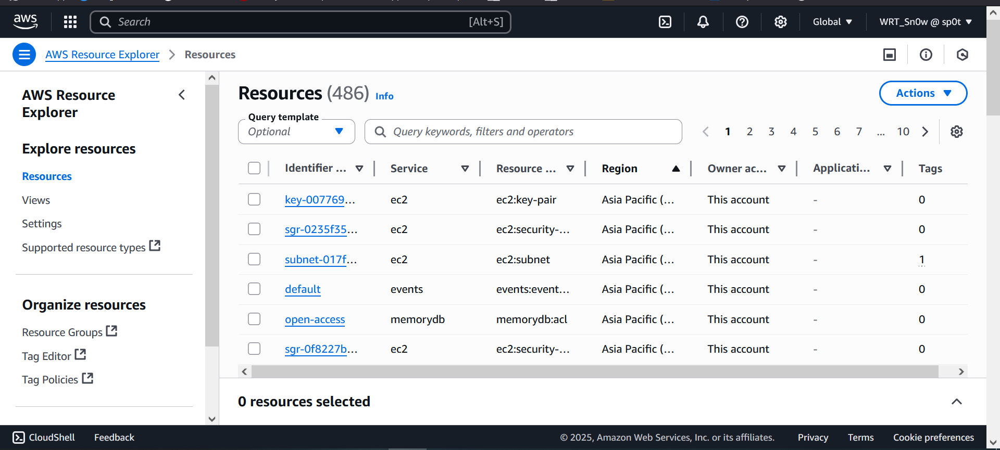  
*Initial state of AWS resources before running AWS Nuke. This shows the AWS account with existing resources that will be cleaned up.*

---

## 🎬 Full Video Walkthrough

[](screenshots/aws-nuke-demo.mp4)  
*Click the image above to watch a full screen-recorded walkthrough of the entire AWS Nuke process, from setup to verification. This video demonstrates every step shown below in real time.*

---

## 📖 What is AWS Nuke?

<p align="center">
  
  
</p>

AWS Nuke is an open-source tool designed to delete all resources in an AWS account. It ensures that your account is restored to a clean slate, similar to its default state. This is particularly useful for testing, development, or compliance purposes.

---

## 🛠 Prerequisites

<p align="center">
  
  
  
</p>

Before you begin, ensure the following:

1. **AWS CLI Installed**: Install or update the AWS CLI by following [this guide](https://docs.aws.amazon.com/cli/latest/userguide/getting-started-install.html).
2. **AWS Account Access**: Ensure you have administrative access to the AWS account you want to reset.
3. **AWS Nuke Installed**: Install AWS Nuke using the instructions below.

---

## 📦 Installation Steps

### 1️⃣ Install AWS CLI

Follow the official guide to install the AWS CLI:  
🔗 [AWS CLI Installation Guide](https://docs.aws.amazon.com/cli/latest/userguide/getting-started-install.html)

**Check AWS CLI version:**
```bash
aws --version
```
  
*Run `aws --version` to verify that the AWS CLI is installed correctly and accessible from your terminal.*

### 2️⃣ Configure AWS CLI

Run the following command to configure your AWS CLI:
```bash
aws configure
```
Provide your AWS access key, secret key, region, and output format.

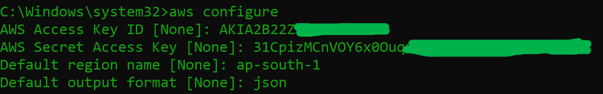  
*Configure your AWS CLI with your credentials and default region. This step is required for AWS Nuke to access your account.*

### 3️⃣ Install AWS Nuke

Install AWS Nuke based on your operating system:

- **macOS**:  
  ```bash
  brew install cloud-nuke
  ```
- **Linux**:  
  ```bash
  brew install cloud-nuke
  ```
- **Windows**:  
  ```bash
  winget install cloud-nuke
  ```

*Choose the installation command based on your OS. This will install the AWS Nuke tool required for the reset process.*

---

## 🔧 Usage Instructions

### Step-by-Step Commands:

1. **Verify AWS CLI Installation**  
   ```bash
   aws --version
   ```
     
   *Ensure the AWS CLI is working before proceeding.*

2. **List S3 Buckets (Optional)**
   ```bash
   aws s3 ls
   ```
   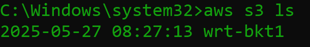  
   *Optionally, list your S3 buckets to see what resources exist before nuking.*

3. **Check AWS Nuke Help**
   ```bash
   cloud-nuke -h
   ```
   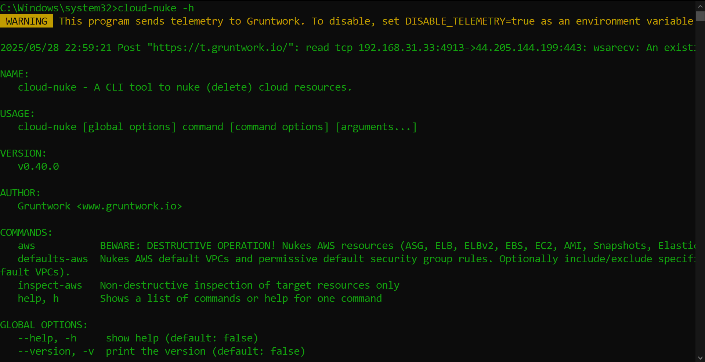  
   *Display the help menu for AWS Nuke to see available commands and options.*

4. **Inspect AWS Resources**
   ```bash
   cloud-nuke inspect-aws --region ap-south-1
   ```
   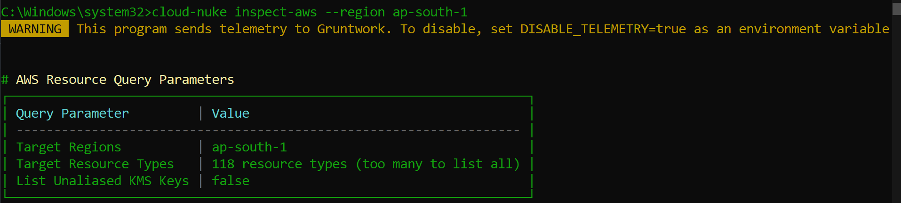  
   *Scan your AWS account for all resources in the specified region before deletion.*

   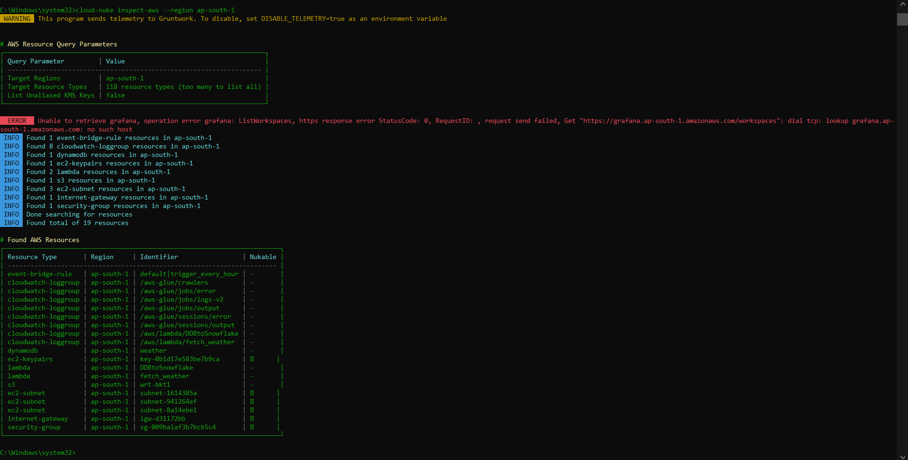  
   *Detailed output of resources found during inspection. Review this to understand what will be affected.*

5. **List Resource Types**
   ```bash
   cloud-nuke aws --list-resource-types
   ```
   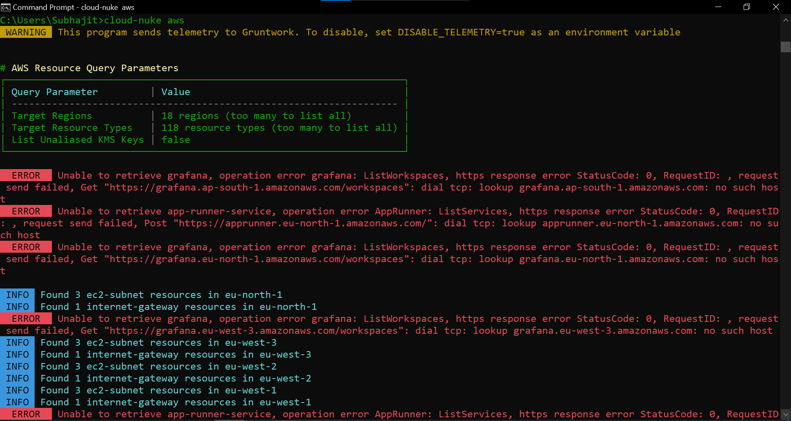  
   *See all resource types that AWS Nuke can delete. Useful for targeting specific resources.*

6. **Perform a Dry Run**
   ```bash
   cloud-nuke aws --resource-type ec2 --dry-run
   ```
   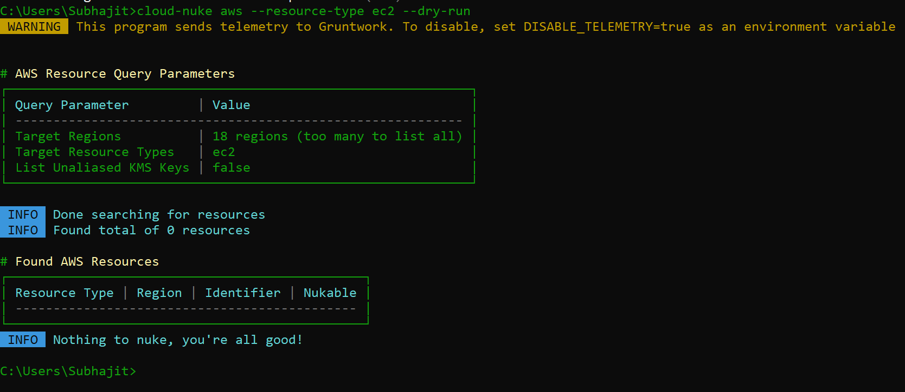  
   *Simulate the deletion process to preview what will be removed. Always do a dry run before actual nuking!*

7. **Execute AWS Nuke**
   ```bash
   cloud-nuke aws --region ap-south-1
   ```
   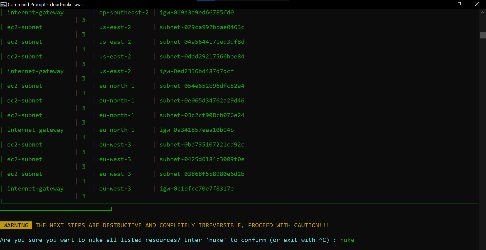  
   *AWS Nuke will ask for confirmation before proceeding with deletion.*

   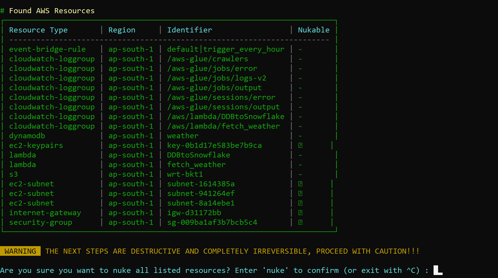  
   *Final list of resources to be deleted. Double-check this list before confirming!*

   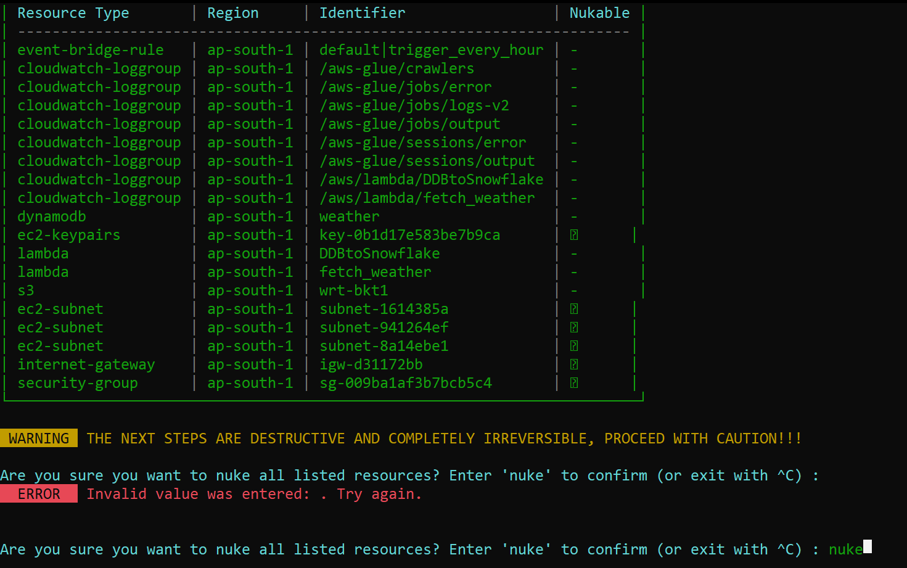  
   *Type 'yes' to confirm and start the nuke operation.*

   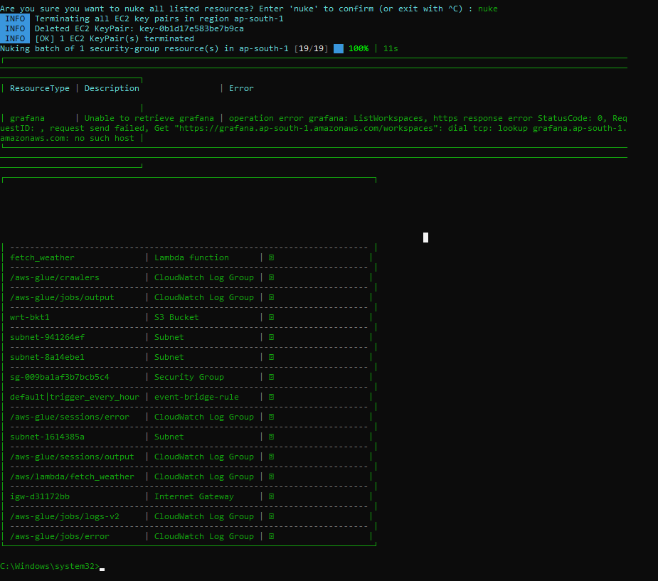  
   *AWS Nuke has finished deleting resources. Your account should now be clean.*

   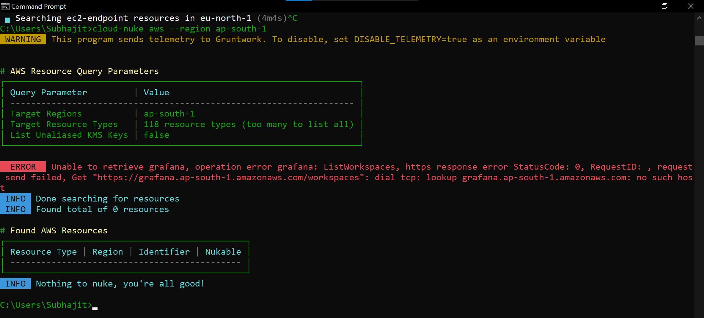  
   *Verify that all resources have been deleted by listing resources again. Your account should now be empty.*

---

## 🔒 Security Notice

**IMPORTANT**: This repository contains documentation about AWS resource management. When using this guide:

1. Never commit AWS credentials to GitHub.
2. Always use AWS best practices for credential management.
3. Use AWS IAM roles and temporary credentials where possible.
4. Remove any sensitive information from screenshots.
5. Add credential files to `.gitignore`.

For AWS credential management best practices, refer to the [AWS Security Best Practices](https://docs.aws.amazon.com/IAM/latest/UserGuide/best-practices.html) guide.

---

## ⚠️ Important Notes

- **Dry Run**: Always perform a dry run before executing AWS Nuke to ensure you understand the resources being deleted.
- **Irreversible Action**: AWS Nuke deletes resources permanently. Double-check before proceeding.
- **Region-Specific**: Specify the region to target specific resources.

---

## 📚 Additional Resources

- **AWS Nuke GitHub Repository**:  
  🔗 [rebuy-de/aws-nuke](https://github.com/rebuy-de/aws-nuke)  
  🔗 [gruntwork-io/cloud-nuke](https://github.com/gruntwork-io/cloud-nuke)

- **YouTube Tutorial**:  
  🎥 [AWS Nuke Guide](https://youtu.be/odk_NuQNJTc?si=wypMlFZcLFyxkEd9)

---

## 🎯 Project Goals

This repository aims to:

1. Provide a clear and concise guide for resetting AWS accounts using AWS Nuke.
2. Document commands and resources for future reference.
3. Ensure safe and efficient usage of AWS Nuke.

---

## 🤝 Contributions

Feel free to contribute by improving documentation or adding new features. Open a pull request or raise an issue for suggestions.

---

## ❤️ Created With Love

This project was created with ❤️ by **Subhajit Chowdhury**. Special thanks to my senior **[Senior's Name]** for suggesting this tool and guiding me through the process.

### Connect With Me:  
- 🌐 [LinkedIn](https://www.linkedin.com/in/subhajitch0wdhury/)  
- 🐙 [GitHub](https://github.com/Subhajit-Chowdhury)  
- 📧 Email: er.subhajitchowdhury@gmail.com

---

## 📜 License

This project is licensed under the MIT License. See the LICENSE file for details.

---

## 🔗 References

- **AWS CLI Documentation**: [AWS CLI Guide](https://docs.aws.amazon.com/cli/latest/userguide/getting-started-install.html)
- **AWS Nuke GitHub Repository**: [rebuy-de/aws-nuke](https://github.com/rebuy-de/aws-nuke)

---

Thank you for visiting the **Nuke_AWS** project! 🌟  
Happy nuking! 💥